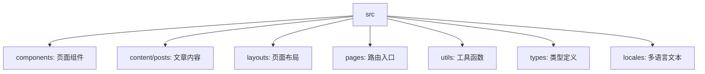
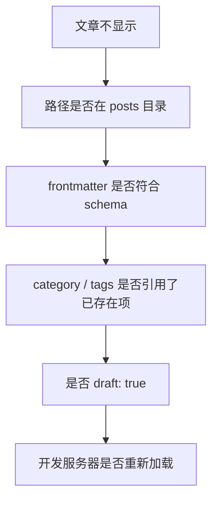

这篇文章不是一份“从零开始”的官方教程，更像我搭建博客时留下的一份路线图。真正重要的不是某一条命令，而是弄清楚：Astro 项目里哪些文件控制内容，哪些文件控制页面，哪些配置决定博客最终长什么样。

## 为什么选 Astro

Astro 的特点是“内容优先”。它并不要求每个页面都变成一个复杂的前端应用，而是把 Markdown、组件、布局和静态生成结合起来。对博客来说，这一点很合适：文章应该是核心，交互只是补充。

我这次使用的是 Yukina 主题。它基于 Astro，并配合 Tailwind CSS、Svelte、astro-icon、Pagefind 等工具。这个组合大致可以理解为：

- Astro 负责页面生成和内容组织；
- Tailwind CSS 负责样式；
- Svelte 用于局部交互组件；
- Pagefind 用于站内搜索；
- astro-icon 用于图标管理。

它不是一个只有皮肤的主题，而是已经替我搭好了博客常见的骨架。

## 搭建入口

Astro 项目的创建命令很直接：

```bash
pnpm create astro@latest
```

如果使用现成主题，真正要做的往往不是“从空项目写到可用”，而是先理解主题如何组织内容。否则后面改首页、改导航、加文章分类时，很容易变成在文件夹里盲找。

## 目录结构的理解

Yukina 项目里最值得先看的几个目录是：



从修改博客的角度看，可以先抓住三条线：

第一，文章放在哪里。  
博客文章通常进入 `src/content/posts` 或主题约定的文章目录，由内容集合统一校验 frontmatter。

第二，页面在哪里生成。  
`src/pages` 更接近路由入口，它决定访问某个路径时展示什么页面。

第三，样式和结构在哪里复用。  
`components` 和 `layouts` 决定页面内部如何拼装，适合改导航、首页块、文章卡片和整体排版。

## 配置文件比想象中重要

主题项目里，配置常常比页面本身更像“控制台”。比如 `yukina.config.ts` 里会放站点名称、导航、作者信息、社交链接、首页展示方式等内容。

这类配置文件适合先读，不适合一上来就改组件。因为很多页面元素并不是写死在组件里，而是由配置注入。如果没先确认配置入口，就容易改错地方。

内容集合的配置也很关键。它决定文章必须有哪些字段，比如标题、创建日期、分类、标签、摘要等。文章不显示时，第一反应不应该是怀疑页面组件，而要先检查 frontmatter 是否符合 schema。

## 首页修改的思路

我在笔记里记录过首页 banner、打字机效果、背景和溢出处理。这类修改可以分成两层：

- 结构层：页面上有什么内容块；
- 表现层：内容块如何动画、排版和响应式展示。

比如打字机效果，本质不是“炫技”，而是首页副标题的一种呈现方式。它可以用简单的 HTML、CSS 和少量 JavaScript 完成，但需要注意两点：

一是不要让文字动画影响布局高度。  
二是移动端不能因为动画文字过长导致溢出。

因此，像 `white-space`、`overflow`、容器宽度和断行策略，往往比动画本身更重要。

## 文章不显示时先查什么

博客搭好之后，最常见的问题是“文件已经放进去了，但页面不显示”。这种情况通常按下面顺序排查：



尤其是分类和标签，如果主题使用的是引用型配置，就不能随便写一个新字符串。比如分类必须先存在于 categories 配置里，标签也要对应已有 slug。否则文章文件本身是 Markdown，但内容集合校验会失败，最终页面就不会正常生成。

## 小结

Astro 博客的维护并不难，但它要求我从“改网页”的思维切换到“维护内容系统”的思维。文章、路由、布局、组件、配置各自有边界。先找到边界，再动手修改，后面写文章和改页面都会稳定很多。

对个人博客来说，这套结构也有一个好处：它迫使我把笔记整理成有标题、有摘要、有分类的文本。也就是说，博客不是单纯发布内容的地方，它也反过来训练我把散乱笔记整理成可以被别人阅读的文章。
