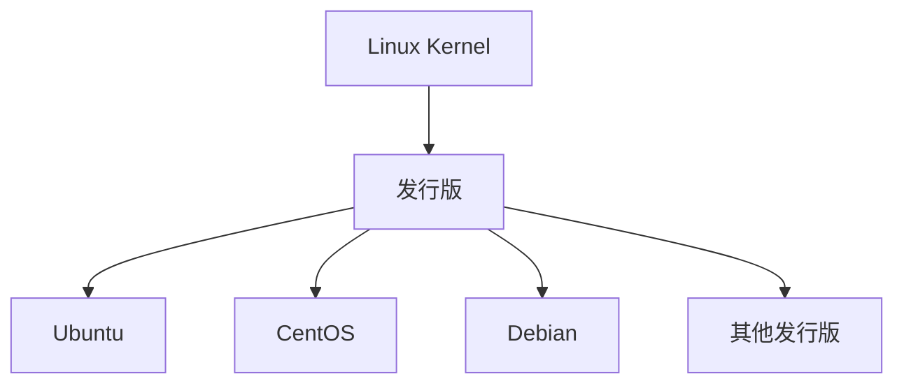

Linux 入门的第一步，不是立刻背命令，而是先知道自己在操作什么。很多命令看起来零散，其实都围绕一个共同对象展开：文件系统。

只要理解 Linux 把目录、文件、设备、配置都组织在统一的路径结构中，后面的命令就会更容易连起来。

## Linux 是什么

严格说，Linux 指的是内核。我们日常使用的“Linux 系统”，通常是 Linux 内核加上各种系统工具、软件包管理器和用户空间程序组成的发行版。

常见发行版包括 CentOS、Ubuntu、Debian 等。服务器场景中，Linux 使用非常广泛，因为它稳定、资源占用相对低、适合远程管理，也适合部署数据库、中间件和后端服务。



## 学习环境

学习 Linux 常见有两种方式。

一种是在虚拟机中安装 CentOS 或其他发行版，然后用 FinalShell、Xshell 这类工具远程连接。这样更接近真实服务器环境。

另一种是在 Windows 上使用 WSL，比如 Ubuntu + Windows Terminal。它更轻量，适合日常命令练习和开发环境配置。

不管哪种方式，核心都是通过终端和 Shell 与系统交互。

## 路径是 Linux 命令的地图

进入终端后，最常用的命令是查看当前位置和切换目录：

```bash
pwd

cd /home

cd ..

cd ~
```

其中：

- `/` 表示根目录；
- `.` 表示当前目录；
- `..` 表示上一级目录；
- `~` 表示当前用户的家目录。

路径可以分为绝对路径和相对路径。绝对路径从 `/` 开始，相对路径则以当前目录为参照。

## ls：先学会看目录

`ls` 用来查看目录内容，是最常用的命令之一：

```bash
ls

ls -a

ls -l

ls -lh
```

常见参数含义：

- `-a` 显示隐藏文件；
- `-l` 使用长格式显示权限、用户、大小、时间等信息；
- `-h` 让文件大小更容易阅读，通常和 `-l` 搭配；
- `-p` 给目录追加 `/`；
- `-r` 反向排序。

很多系统里还会有 `ll`，它通常是 `ls -l` 或类似命令的别名。

## 创建和查看文件

创建目录可以用：

```bash
mkdir test

mkdir -p a/b/c
```

`-p` 的作用是递归创建多级目录。如果中间目录不存在，也会一并创建。

创建空文件可以用：

```bash
touch note.txt
```

查看文本内容可以用：

```bash
cat note.txt

more note.txt
```

`cat` 适合查看较短文件，`more` 适合分页查看较长文件。

## 复制、移动和删除

文件操作中最常用的是 `cp`、`mv`、`rm`：

```bash
cp source.txt target.txt

mv old.txt new.txt

rm file.txt
```

`cp` 复制，`mv` 可以移动，也可以重命名，`rm` 删除。

删除命令要格外谨慎，尤其是递归删除目录时。学习阶段可以多用 `pwd` 和 `ls` 确认当前位置，避免在错误目录下执行删除。

## 小结

Linux 基础命令并不是孤立的。`pwd` 确认位置，`cd` 移动位置，`ls` 查看内容，`mkdir` 和 `touch` 创建对象，`cat` 和 `more` 查看文件，`cp`、`mv`、`rm` 修改文件状态。

这些命令共同构成了对文件系统的基本操作能力。后面学习部署服务、查看日志、配置环境变量，本质上仍然离不开这套基础。
