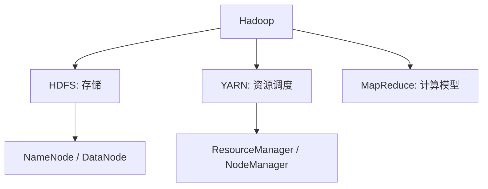
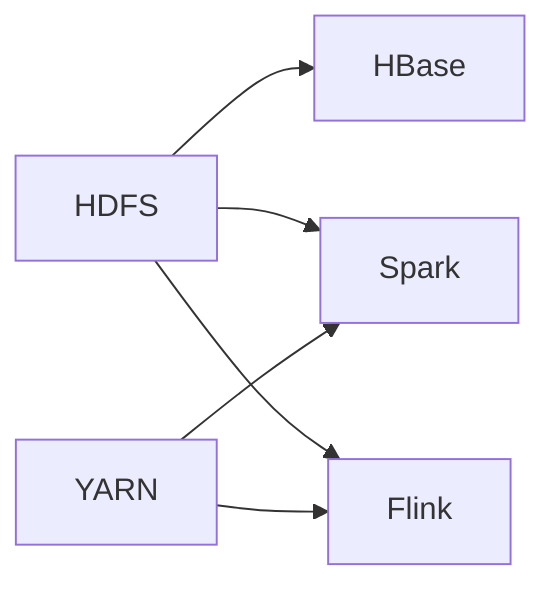
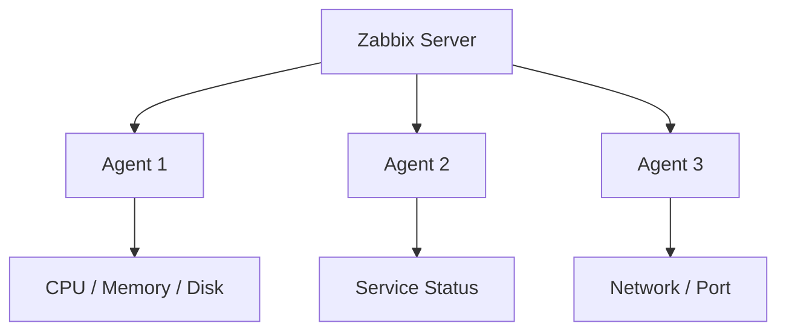

学到 Hadoop、HBase、Spark、Flink、Zabbix 这类组件时，笔记很容易变成一串安装步骤：上传压缩包、解压、改配置、分发文件、启动进程、查看状态。

这些步骤当然重要，但如果只记命令，很快就会忘。更稳定的理解方式是先看它们共同依赖的部署逻辑。

## 大数据组件部署的共同前提

不管部署哪个组件，通常都绕不开几件事：

- 多台 Linux 主机；
- 固定的主机名和内网地址；
- SSH 免密登录；
- Java 或对应运行环境；
- 环境变量；
- 配置文件；
- 日志目录和数据目录；
- 启停脚本与状态检查。

这些内容看起来像“准备工作”，但实际是部署能否成功的基础。尤其是主机名、端口、环境变量和权限，一旦配置不一致，后面启动组件时会出现很难定位的问题。

## Hadoop 的位置

Hadoop 通常是大数据学习中的基础组件。它提供分布式存储和资源调度能力：

- HDFS 负责分布式文件存储；
- YARN 负责资源调度；
- MapReduce 是早期计算模型。

理解这些角色比死记配置文件更重要。比如 HDFS 里 NameNode 管理元数据，DataNode 保存真实数据块；YARN 里 ResourceManager 管资源，NodeManager 管具体节点。

## HBase、Spark、Flink 各自解决什么

HBase 通常构建在 HDFS 之上，适合海量结构化数据的随机读写。它更像一个分布式列式存储系统。

Spark 面向批处理和内存计算，适合数据分析、ETL、机器学习等场景。它可以跑在 YARN 上，也可以连接 HDFS、Hive 等组件。

Flink 更强调流处理，也能做批处理。它适合实时计算场景，比如实时指标、实时风控、实时日志处理。

这样看，组件之间不是平行堆叠，而是形成生态关系：底层存储、资源调度、批计算、流计算、数据库式访问，各自负责不同问题。

## 配置文件是组件的边界说明

部署这些系统时，常见动作是修改配置文件。比如：

- 哪些节点是 master；
- 哪些节点是 worker；
- 数据目录在哪里；
- 日志写到哪里；
- 端口是多少；
- 依赖哪个 Java 环境；
- 连接哪个 Hadoop 集群。

配置文件本质上是在告诉组件：“你属于哪个集群，你依赖谁，你把数据放哪，你对外暴露什么入口。”

所以读配置时，不要只看参数名，而要想它描述的是哪一种关系。

## Zabbix 的角色不同

Zabbix 和 Hadoop 生态组件不完全是一类东西。它不是数据计算框架，而是监控系统。

它关心的是服务器、服务和指标是否正常。比如 CPU、内存、磁盘、网络、进程状态、端口状态等。部署复杂系统以后，监控就变得重要，因为人不可能一直手工登录服务器检查状态。

从学习路径看，Zabbix 能帮助我从“会启动服务”进一步走向“能观察服务”。

## 部署笔记应该怎么整理

原始部署笔记里经常包含具体 IP、密码、路径和账号。发布成博客时，这些内容不应该原样出现。更合适的方式是：

- IP 写成 `192.168.x.x`；
- 密码写成 `<password>`；
- 机器名写成 `node1`、`node2`、`node3`；
- 路径保留结构，但不要暴露真实个人目录；
- 命令保留关键步骤，不把所有终端输出复制进去。

这样既保留了学习价值，也避免泄露环境信息。

## 小结

Hadoop 生态部署学习的核心，不是背下每个组件的安装命令，而是理解大数据系统共同的组织方式：多节点、角色分工、配置文件、运行环境、日志和监控。

当我能说清楚每个组件解决什么问题、依赖哪些基础条件、配置项描述了什么关系，再去看具体部署命令，就不会只是机械复制，而是在搭一个可解释的系统。
