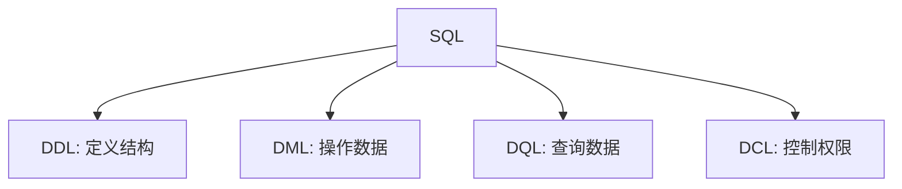

学 MySQL 时，最容易遇到的问题不是命令太难，而是命令太多。创建数据库、建表、插入数据、修改字段、查询记录，每一类语句都有自己的写法。如果只记零散命令，很快就会混在一起。

更好的方式是先按照 SQL 的功能分类理解它们。

## SQL 的几类语言

MySQL 中常见 SQL 可以粗略分成几类：

- DDL：数据定义语言，用来定义数据库、表、字段；
- DML：数据操作语言，用来新增、修改、删除表中的数据；
- DQL：数据查询语言，用来查询数据；
- DCL：数据控制语言，用来管理用户、权限等。



这条分类很重要。因为它把“改结构”和“改数据”分开了。比如 `ALTER TABLE` 改的是表结构，而 `UPDATE` 改的是表里的记录。两者都可能影响系统，但性质完全不同。

## 数据库层面的操作

数据库是表的容器。常见操作包括查看、创建、使用和删除数据库：

```sql
SHOW DATABASES;

CREATE DATABASE my_database;

USE my_database;

DROP DATABASE my_database;
```

实际学习时，`USE` 很关键。很多新手问题不是 SQL 写错，而是当前连接选中的数据库不对。

## 建表是对数据形状的声明

建表时，我其实是在回答几个问题：这个对象有哪些字段？每个字段是什么类型？哪些字段不能为空？哪个字段可以作为主键？

一个简单员工表可以这样写：

```sql
CREATE TABLE emp (
  id INT COMMENT '编号',
  workno VARCHAR(10) COMMENT '工号',
  name VARCHAR(10) COMMENT '姓名',
  gender CHAR(1) COMMENT '性别',
  age TINYINT UNSIGNED COMMENT '年龄',
  idcard CHAR(18) COMMENT '身份证号',
  entrydate DATE COMMENT '入职时间'
) COMMENT '员工表';
```

字段类型不是装饰。比如年龄用 `TINYINT UNSIGNED`，是因为年龄不需要很大的整数，也不应该为负数；身份证号用 `CHAR(18)`，是因为它长度固定，更接近字符串而不是数字。

## 修改表结构

表创建后，也经常需要调整结构。比如增加字段、修改字段类型、改字段名、删除字段、重命名表：

```sql
ALTER TABLE emp ADD nickname VARCHAR(20);

ALTER TABLE emp MODIFY nickname VARCHAR(30);

ALTER TABLE emp CHANGE nickname username VARCHAR(30);

ALTER TABLE emp DROP username;

ALTER TABLE emp RENAME TO employee;
```

这些都属于 DDL。它们改变的是表本身的结构，因此在真实项目里需要谨慎。尤其是已经有数据的表，改字段类型或删除字段前要确认影响范围。

## DML：对记录的增删改

DML 面向的是表中的数据。常见操作是插入、更新和删除：

```sql
INSERT INTO employee (id, workno, name, gender, age, idcard, entrydate)
VALUES (1, '0001', '张三', '男', 25, '110000000000000000', '2026-06-27');

UPDATE employee
SET age = 26
WHERE id = 1;

DELETE FROM employee
WHERE id = 1;
```

这里最应该养成的习惯是：写 `UPDATE` 和 `DELETE` 时先想 `WHERE`。没有条件的更新和删除会作用于整张表，这在学习环境里只是错误，在生产环境里就是事故。

## DQL：查询才是日常主力

查询语句看似只有 `SELECT`，但它会逐渐变得复杂。最基础的形式是：

```sql
SELECT * FROM employee;

SELECT id, name, age FROM employee;

SELECT * FROM employee WHERE age > 20;
```

`WHERE` 是查询进入业务语义的开始。它让“查所有员工”变成“查年龄大于 20 的员工”“查某个部门的员工”“查某个时间之后入职的员工”。

后续再学习排序、分组、分页、聚合函数、连接查询，本质上都是在回答更复杂的数据问题。

## 小结

MySQL 入门不要先追求记住所有语法，而要先建立几个边界：

DDL 改结构，DML 改数据，DQL 查数据，DCL 管权限。  
表结构决定数据如何被保存，查询条件决定数据如何被取出。  
真实项目里最常见的问题，往往不是 SQL 语法完全不会，而是没有意识到某条语句到底在影响结构、记录，还是查询结果。

把这个脉络建立起来之后，再补具体语法，学习会稳很多。
