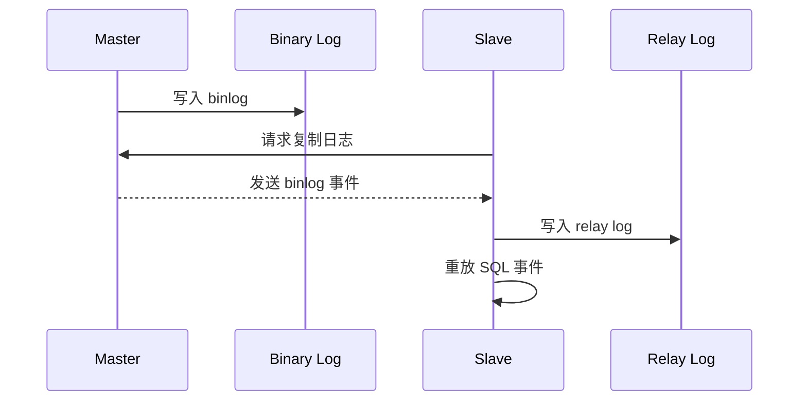
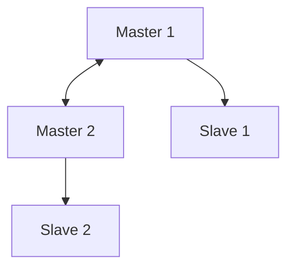
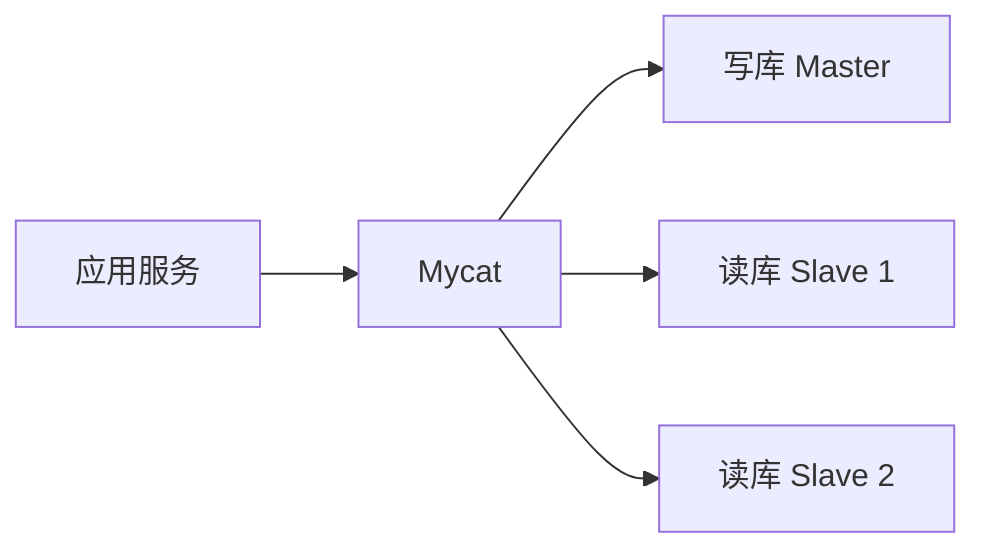

在单机 MySQL 之外，数据库学习会很快进入一个更工程化的问题：如果读写压力变大，或者希望数据库具备一定的高可用能力，应该如何组织多个 MySQL 实例？

我的笔记里记录了“双主双从”和 Mycat 读写分离。这里不保留具体服务器地址和密码，只整理配置思路。

## 主从复制解决什么问题

主从复制的核心是：主库记录数据变更，从库读取这些变更并重放，从而让多个数据库实例保持近似一致。

最基本的流程可以理解为：



复制并不会让数据库自动“无限扩容”，但它提供了读写分离、备份、容灾和高可用架构的基础。

## 双主双从的大致结构

双主双从可以理解为两个主库互为主从，同时每个主库又挂一个从库：



这种结构看起来复杂，但它背后的关注点很清楚：

- 每个 MySQL 实例必须有不同的 `server-id`；
- 主库需要开启 binlog；
- 从库需要知道复制源、日志文件和位置；
- 双主时要避免自增主键冲突；
- 业务侧最好通过中间件或代理控制读写流向。

## 配置复制的关键项

在主库配置中，常见配置包括：

```ini
server-id=1
log-bin=mysql-bin
binlog-do-db=<database-name>
```

从库或另一个主库需要配置自己的 `server-id`，并通过复制命令指定来源：

```sql
CHANGE REPLICATION SOURCE TO
  SOURCE_HOST = '192.168.x.x',
  SOURCE_USER = '<replication-user>',
  SOURCE_PASSWORD = '<password>',
  SOURCE_LOG_FILE = '<log-file>',
  SOURCE_LOG_POS = <pos>;

START SLAVE;
```

具体命令会因 MySQL 版本不同略有差异。旧版本常见 `CHANGE MASTER TO`，新版本推荐 `CHANGE REPLICATION SOURCE TO`。学习时要注意自己使用的 MySQL 版本。

## 为什么需要 Mycat

即使主从复制配置好了，应用也不应该随意连接多个数据库。否则每个业务服务都要自己判断哪个库负责写、哪个库负责读，系统会变得很难维护。

Mycat 的角色可以理解为数据库中间件。应用连接 Mycat，Mycat 再根据配置把请求路由到不同的 MySQL 实例：



这样应用侧看到的是一个统一入口，底层读写分离由 Mycat 配置处理。

## schema.xml 与 server.xml

Mycat 配置里常见两个文件：

- `schema.xml`：定义逻辑库、逻辑表、数据节点、读写主机；
- `server.xml`：定义用户、密码、访问的逻辑库等。

其中 `balance`、`switchType` 这类配置会影响读请求如何分配，以及主库故障时如何切换。学习时不必一开始就背所有参数，但要知道它们控制的是“请求怎么走”。

## 配置里最容易忽略的事

第一，复制账号要有合适权限，但不要用过大的权限。  
第二，配置文档里不要保留真实密码、真实公网地址。  
第三，主从复制有延迟，因此读写分离并不等于所有读都能立刻读到最新写入。  
第四，双主架构要认真处理写冲突，不能只看复制是否启动成功。

这些问题在学习环境里不明显，但在真实系统里都很关键。

## 小结

双主双从和 Mycat 不是几条命令的堆叠，而是一种数据库架构思路：用复制把数据变化同步到多个实例，再用中间件把应用请求组织起来。

真正值得掌握的是每一层的职责：MySQL 负责存储和复制，Mycat 负责路由和读写分离，应用尽量面对稳定入口。这样理解以后，再回头看 `server-id`、binlog、复制位点、`schema.xml`，它们就不再是孤立配置项。
