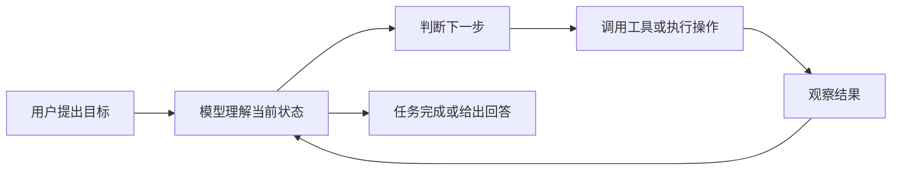
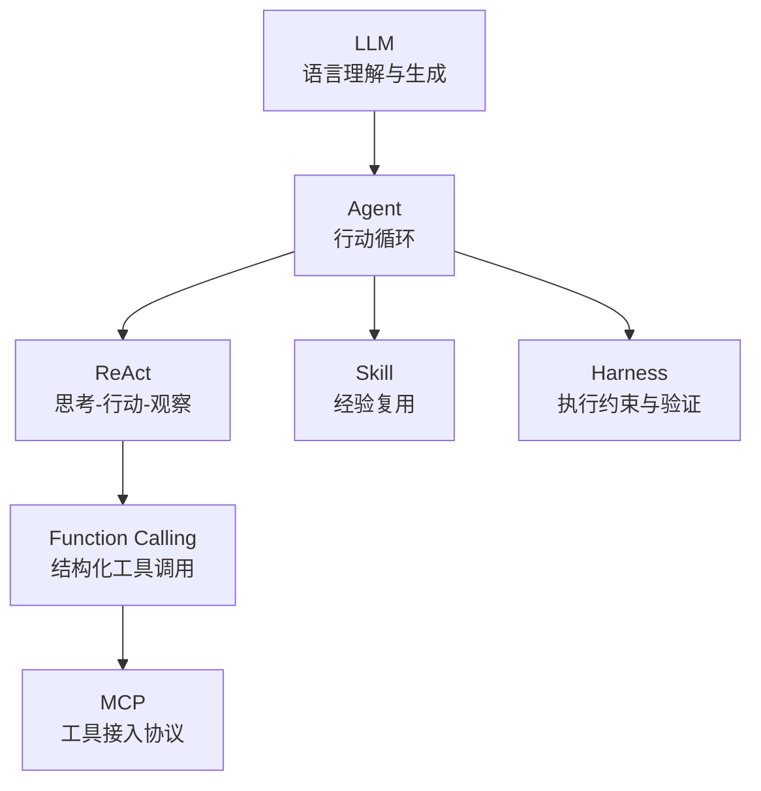

## 前言

如果从普通用户的感受来说，很多人第一次真正意识到“大语言模型”这件事，大概是在 2022 年底 ChatGPT 出现之后。

严格说，GPT-3 并不是 2022 年才有。GPT-3 更早就已经发布了。但对大多数人来说，2022 年的 ChatGPT，或者说 GPT-3.5 这一代产品，才是大语言模型第一次以一种非常直观的方式进入日常经验：你输入一句自然语言，它生成一段看起来很像人写的回答。

这也是我最开始理解 AI 的方式。

所谓 LLM，也就是 Large Language Model，大语言模型。它的基本交互方式很简单：用户输入文本，模型根据上下文预测接下来最可能出现的 token，再不断生成后续内容。

从表面看，它像是在“理解”和“回答”。但从机制上说，它更接近一种基于上下文的语言生成系统。

这件事本身已经足够惊人。因为它让机器第一次大规模具备了用自然语言和人交流的能力。可是当我们继续往下看，就会发现：**会回答问题，和能完成任务，中间还有很长一段距离。**

后面出现的 Agent、Function Calling、MCP、Skill、Harness 等概念，基本都可以放在这条线索里理解：它们不是凭空冒出来的新名词，而是在试图回答同一个问题：

**如何把一个会生成语言的模型，变成一个可以使用工具、接收反馈、持续推进任务的系统。**

## LLM 的能力边界

LLM 最擅长的事情，是在语言层面进行生成、归纳、改写、解释和推理。

比如：

- 解释一个概念
- 总结一篇文章
- 改写一段文字
- 写一段代码
- 根据上下文回答问题

这些能力都建立在一个前提上：任务主要发生在“文本空间”里。

但如果问题超出文本空间，LLM 就会遇到明显边界。

比如我们问：

> 今天北京天气怎么样？适不适合出门？

一个纯粹的 LLM 并不知道今天的实时天气。它的训练数据有截止时间，也不能主动联网，更不能自己打开天气网站或调用天气接口。

它当然可以生成一段看似合理的回答，但这种回答不一定来自真实数据。

这就是 LLM 的第一个边界：**它可以生成语言，但不能自动接触外部世界。**

再比如，我们让它：

> 帮我把这个文件重命名，然后提交到 Git。

如果只是语言模型本身，它没有文件系统权限，也不会真的执行命令。它最多告诉你应该怎么做。

这就是第二个边界：**它可以描述操作，但不能天然执行操作。**

于是，从 LLM 到 Agent 的问题就出现了。

## Agent：让模型进入行动循环

Agent 这个词很容易被说得很玄，好像它代表某种完全自主的人工智能。

但如果放在工程语境里看，Agent 最关键的变化其实是：**让 LLM 不再只是一次性回答，而是进入一个“观察、思考、行动、再观察”的循环。**

一个最简单的 Agent 流程可以这样理解：



这个循环使模型和外部世界之间建立了关系。

模型不只是根据已有上下文生成一句话，而是可以：

1. 判断自己缺少什么信息
2. 选择一个工具
3. 调用工具
4. 读取返回结果
5. 根据结果继续判断

这就是 Agent 的核心。

所以，我现在不太愿意把 Agent 理解成“一个很聪明的 AI 人格”。那样容易把问题神秘化。

更准确地说，Agent 是一种系统结构：它把 LLM 放进一个可以使用工具、接收反馈、持续迭代的执行环境里。

## Workflow 与 Agent

理解 Agent 时，还需要区分它和 Workflow。

Workflow 是预先写好的流程。它的特点是步骤清楚，路径固定。

比如一个文档处理流程：

1. 读取输入
2. 提取标题
3. 生成摘要
4. 输出结果

这类任务里，AI 可以作为某个步骤里的组件，但整体流程并不由 AI 自己决定。

Agent 则不同。Agent 的特点是下一步不完全预设，而是由模型根据当前状态判断。

比如做一个技术调研：

1. 先搜索资料
2. 发现资料太旧，换关键词
3. 发现某个概念不清楚，继续查
4. 发现不同资料互相矛盾，做比较
5. 最后形成结论

这里的路径不是一开始完全写死的，而是在执行过程中逐步形成。

因此可以简单区分：

| 概念     | 核心特征                 |
| -------- | ------------------------ |
| Workflow | 固定流程，适合确定性任务 |
| Agent    | 动态决策，适合开放性任务 |

当然，这并不意味着 Agent 一定比 Workflow 高级。相反，很多场景里 Workflow 更可靠。

Agent 的价值在于处理那些“路径不确定”的任务；而它的风险，也恰恰来自这种不确定性。

## ReAct：把推理和行动放在一起

Agent 里一个很重要的思想是 ReAct，也就是 Reasoning + Acting。

这个词看起来像论文术语，但含义并不复杂：模型不是只在脑子里推理，也不是盲目调用工具，而是在推理和行动之间循环。

比如天气建议这个例子：

1. Reasoning：我需要知道今天北京的天气
2. Acting：调用天气 API
3. Observation：得到温度、降雨概率、风力等信息
4. Reasoning：根据天气判断出门建议
5. Answer：给出最终回答

ReAct 的意义在于，它让模型的“思考”不再停留在内部文本生成，而是和外部操作结合起来。

这也是 Agent 系统的一个基础范式：不是一次性生成答案，而是在每次行动后根据观察结果更新判断。

## Function Calling：从自然语言到工具调用

当我们说 Agent 可以调用工具时，马上会遇到一个问题：模型如何调用工具？

人类给出的指令是自然语言，而程序需要的是结构化参数。

用户可能说：

> 查一下这个 UP 主的粉丝量。

但工具真正需要的可能是：

```json
{
  "name": "get_fans",
  "arguments": {
    "up_id": "123456"
  }
}
```

这就是 Function Calling 的位置。

Function Calling 并不是工具本身。它解决的是模型和工具之间的翻译问题：模型需要根据用户意图，生成一段结构化调用，说明要用哪个函数、传入什么参数。

换句话说，Function Calling 把自然语言意图转化为程序可以执行的接口调用。

这个能力非常关键。

没有它，LLM 即使“知道”应该查粉丝量，也只能用自然语言描述“你可以调用某某接口”。而有了 Function Calling，它就可以直接输出工具调用请求，让外部程序去执行。

所以在 Agent 系统里，Function Calling 更像是模型伸向工具世界的一只手。

## MCP：工具接入的标准化

Function Calling 解决了模型如何发起工具调用的问题，但还没有解决工具生态的问题。

如果每个 AI 客户端都有自己的工具格式，每个模型又有自己的接入方式，那么工具很难复用。

一个工具今天适配 Claude，明天适配 Cursor，后天适配另一个客户端。如果每次都重新写一套，成本会越来越高。

MCP，也就是 Model Context Protocol，可以理解为在解决这个问题。

它试图让工具以一种统一的协议暴露给 AI 客户端。

在 MCP 的结构里，大概有三类角色：

| 角色        | 作用                                                       |
| ----------- | ---------------------------------------------------------- |
| MCP Client  | AI 客户端，比如 Claude Desktop、Cursor、Codex              |
| MCP Server  | 按 MCP 协议封装好的工具服务                                |
| Data Source | 真正的数据或能力来源，比如文件、数据库、浏览器、GitHub API |

这样一来，工具不再只是某个客户端内部的一段定制逻辑，而可以被包装成一个相对独立的 MCP Server。

如果另一个客户端也支持 MCP，那么理论上它也可以接入同一个工具。

所以我现在会这样理解 Function Calling 和 MCP 的关系：

| 概念             | 关注点                               |
| ---------------- | ------------------------------------ |
| Function Calling | 模型如何表达“我要调用这个工具”       |
| MCP              | 工具如何以统一方式接入不同 AI 客户端 |

一个偏模型能力，一个偏工具协议。

它们不是同一层东西，但经常会一起出现。

## Skill：经验的固化

Agent 能调用工具之后，还会遇到另一个问题：同样的任务，每次都让模型从头想一遍，既浪费上下文，也不稳定。

比如“把视频转换成音频”这个任务。

如果每次都直接问模型，它可能每次都重新思考：

- 用 ffmpeg 还是别的工具
- 命令怎么写
- 输出格式是什么
- 文件保存在哪里
- 出错后怎么处理

这些步骤其实是可以沉淀下来的。

Skill 就可以理解为这种沉淀。

一个 Skill 通常会告诉模型：

- 这个技能适合什么任务
- 执行步骤是什么
- 可以使用哪些工具
- 输入输出应该是什么格式
- 常见错误怎么处理

它不是让模型突然获得新智能，而是把一套可重复的操作经验放在模型可以读取的位置。

所以 Skill 的意义在于：**减少重复推理，让 Agent 在常见任务上表现得更稳定。**

## Harness：执行环境与约束

如果 Agent 只是生成文本，风险有限。

但一旦 Agent 可以读写文件、运行命令、访问数据库、调用外部 API，问题就变得复杂了。

它可能：

- 调错工具
- 写错文件
- 重复执行危险操作
- 没有检查结果就继续下一步
- 在权限不足时盲目尝试
- 把临时判断当成确定结论

因此，一个真正可用的 Agent 系统，不能只看模型能力，还必须看执行环境。

Harness 可以理解为围绕 Agent 的运行框架。它负责权限、边界、日志、验证、错误处理和人类确认。

我现在会这样理解：

**Agent 让模型可以行动，Harness 让行动处在可控范围内。**

这也是为什么一个能真正工作的 AI 系统，不只是“接一个大模型 API”那么简单。它还需要工具层、协议层、权限层、验证层和交互层。

## 这些概念之间的关系

整理到这里，可以把这些概念串成一条线。

LLM 解决的是自然语言理解与生成。  
Agent 解决的是模型如何进入行动循环。  
ReAct 解决的是推理、行动、观察如何交替进行。  
Function Calling 解决的是自然语言意图如何变成结构化工具调用。  
MCP 解决的是工具如何标准化接入不同 AI 客户端。  
Skill 解决的是重复任务经验如何沉淀。  
Harness 解决的是执行过程如何被约束和验证。

它们对应的是不同层面的问题。



如果只看名字，这些概念很容易显得混乱。  
但如果按问题来理解，它们其实是逐层出现的。

LLM 不能接触外部世界，所以需要工具。  
有了工具，就需要调用方式。  
工具多了，就需要协议。  
任务重复了，就需要技能沉淀。  
能执行了，就需要约束和验证。

## 总结

从 2022 年底 ChatGPT 带来的直观体验开始，很多人对 AI 的理解是“一个会聊天、会写东西的模型”。

但今天再看，AI 系统的发展方向已经不只是更会生成文本，而是逐渐走向工具化、系统化和工程化。

LLM 是基础，但不是终点。

Agent、Function Calling、MCP、Skill、Harness 这些概念，真正讨论的是：如何让模型从语言生成器，变成一个可以在外部环境中执行任务的组件。

我现在对这条线的理解还只是阶段性的，但至少有一点越来越清楚：

所谓 AI Agent，并不是把模型说得更像人，而是把模型放进一个能观察、能调用工具、能接收反馈、能被约束的系统里。

从这个角度看，Agent 不是魔法，也不是营销词。它更像是大语言模型走向实际应用时，不得不补上的一组工程结构。
