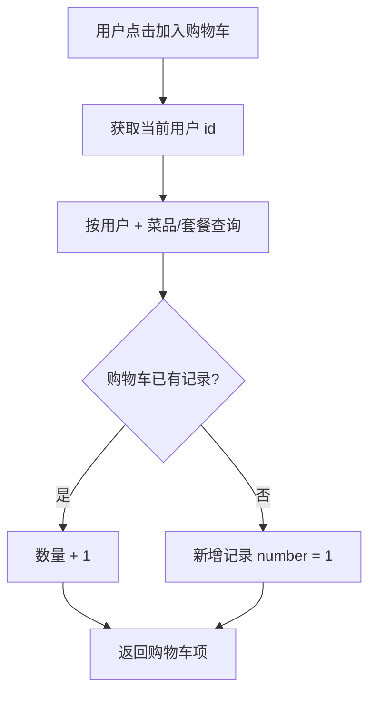
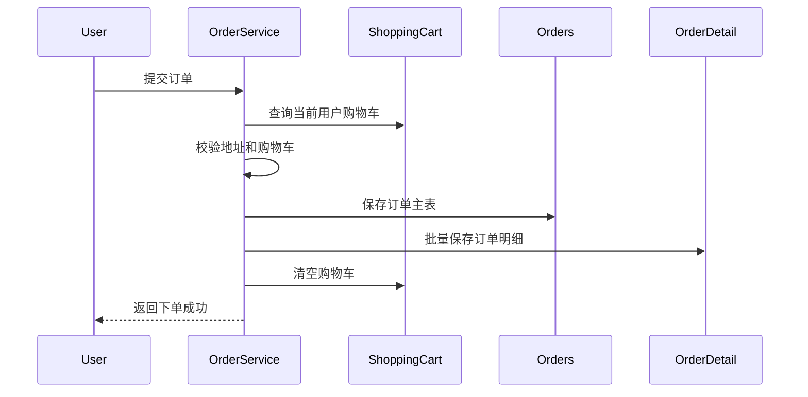

瑞吉外卖项目里，购物车和下单流程比普通 CRUD 更值得整理。因为它不只是对一张表做增删改查，而是把用户、地址、商品、购物车、订单、订单明细串成一条完整链路。

这类业务最容易出错的地方，是只看某个接口内部的代码，而忽略它前后依赖的数据状态。比如“提交订单”并不是凭空生成订单，它依赖购物车已有内容、用户已经登录、地址已经选择。

## 购物车表承担临时状态

购物车表通常保存这些信息：

- 当前用户 id；
- 菜品 id 或套餐 id；
- 菜品口味；
- 商品名称、图片、金额；
- 数量；
- 创建时间。

它不是最终订单，只是用户下单前的临时选择。因此购物车逻辑要解决一个问题：如果用户重复添加同一个菜品，应该新增一行，还是修改数量？

瑞吉外卖里的做法是先按用户和商品查询购物车记录：

```java
LambdaQueryWrapper<ShoppingCart> queryWrapper = new LambdaQueryWrapper<>();
queryWrapper.eq(ShoppingCart::getUserId, currentUserId);

if (shoppingCart.getDishId() != null) {
    queryWrapper.eq(ShoppingCart::getDishId, shoppingCart.getDishId());
} else {
    queryWrapper.eq(ShoppingCart::getSetmealId, shoppingCart.getSetmealId());
}
```

如果记录存在，就把数量加一；如果不存在，就设置当前用户 id 和初始数量，然后保存。



这段逻辑体现了业务判断放在 Service 层的意义。Controller 只接收请求，真正决定“新增还是累加”的，是业务层。

## 查询和清空要按 userId

整理笔记时有一个细节值得特别标出来：购物车查询、清空通常应该按 `userId` 限定，而不是按购物车记录自己的 `id` 限定。

也就是说，类似下面这种条件才符合业务含义：

```java
queryWrapper.eq(ShoppingCart::getUserId, currentUserId);
```

如果误写成按 `ShoppingCart::getId` 比较当前用户 id，代码也许能编译，但业务含义已经错了。这类错误很隐蔽，因为字段类型可能一样，只有结合表结构和业务流程才能看出来。

## 下单不是保存一张 orders 表

提交订单至少涉及四类数据：

1. 当前登录用户；
2. 用户选中的地址；
3. 当前用户的购物车列表；
4. 订单主表和订单明细表。

订单主表记录的是“这一单”的总体信息，例如订单号、用户、地址、总金额、状态。订单明细表记录的是“这一单里有哪些商品”，一条订单通常对应多条明细。



从这个流程看，下单应该放在事务里更合理。因为保存订单、保存明细、清空购物车是一个整体。如果中间某一步失败，系统不应该留下半截订单。

## 金额计算里的 Java 细节

笔记里有一个 Java 语法点：在 lambda 中使用的局部变量要求是 final 或 effectively final。订单金额累加时，如果直接修改普通局部变量，编译会受限制。

因此常见写法会用 `AtomicInteger` 或者先通过流式计算得到结果：

```java
AtomicInteger amount = new AtomicInteger(0);

shoppingCarts.forEach(item -> {
    amount.addAndGet(item.getAmount().multiply(
        new BigDecimal(item.getNumber())
    ).intValue());
});
```

从业务角度看，这段代码是在计算购物车所有商品的总价。从工程角度看，它也提醒我：语法限制会影响业务代码的写法，但不要让写法遮住业务本身。

## DTO 的作用

在菜品列表、订单明细这类场景中，数据库实体往往不够用。比如菜品表只有分类 id，但前端可能要直接显示分类名称；订单明细需要把购物车里的商品信息转成订单明细对象。

这时 DTO 的作用就是组织“接口需要的数据形状”。它不是为了增加复杂度，而是避免把数据库实体硬改成前端视图。

## 小结

购物车和下单流程是瑞吉外卖项目里最像真实业务的一部分。它要求代码不仅能操作单表，还要理解状态流转：

用户选择商品，购物车保存临时状态；提交订单时，系统校验地址和购物车，生成订单主表和明细表，最后清空购物车。

如果把这条链路画出来，再去看代码，很多方法名和查询条件就会变得清楚。项目学习也会从“照着写接口”变成“理解业务如何落到数据库和服务层”。
