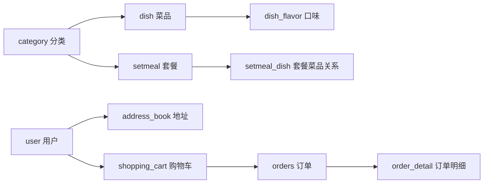
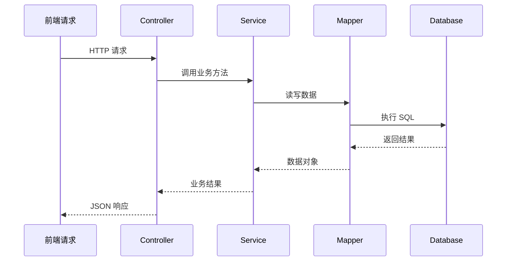

瑞吉外卖这个项目很适合作为 Java Web 入门后的综合练习。它的难点不在某一个语法点，而在于把数据库、后端分层、接口返回、登录状态和业务流程串起来。

如果只跟着代码写，很容易只记住“这里调用了哪个方法”。但把项目整理成文章时，更值得关注的是系统的结构：数据如何存放，请求如何进入，业务在哪里处理，最终又如何返回给前端。

## 数据表先给业务定边界

项目里的核心表大致可以分为几组：

- 员工与用户：`employee`、`user`
- 商品体系：`category`、`dish`、`dish_flavor`、`setmeal`、`setmeal_dish`
- 地址与购物流程：`address_book`、`shopping_cart`
- 订单体系：`orders`、`order_detail`

这些表对应的是外卖业务最基本的对象：后台员工维护分类和菜品，用户在前台选择菜品或套餐，加入购物车，提交订单，系统保存订单和订单明细。



在读这类项目时，先看表结构比先看接口更清楚。因为接口的增删改查最终都要落回这些表，表之间的关系也决定了代码里为什么会出现 DTO、关联查询和批量保存。

## 包结构体现分工

项目常见的包结构包括：

```text
common
config
controller
entity
mapper
service
```

这些目录不是为了“看起来规范”，而是为了把不同层次的代码放在不同位置。

`entity` 对应数据库表。  
`mapper` 负责数据库访问。  
`service` 处理业务逻辑。  
`controller` 接收 HTTP 请求并返回响应。  
`common` 放通用返回结果、上下文、异常处理等公共能力。  
`config` 放过滤器、MVC 配置、静态资源映射等项目配置。

## 三层架构不是形式主义

瑞吉外卖项目中最典型的结构是 Controller-Service-Mapper：



这个分层的关键是职责：

Controller 只负责接收参数、调用服务、返回结果，不应该堆业务判断。  
Service 承担业务流程，比如登录校验、购物车合并、订单创建。  
Mapper 只面向数据库，负责查询和持久化。

这样做的好处是，当业务变复杂时，代码仍然能保持可读。如果把所有逻辑都写在 Controller，短期可能省事，后期会很难维护。

## MyBatis-Plus 让 CRUD 变薄

项目里用了 MyBatis-Plus，所以很多基础 CRUD 不需要手写 SQL。典型写法是：

```java
public interface EmployeeService extends IService<Employee> {
}

public class EmployeeServiceImpl
    extends ServiceImpl<EmployeeMapper, Employee>
    implements EmployeeService {
}

public interface EmployeeMapper extends BaseMapper<Employee> {
}
```

这段代码第一次看会觉得“什么都没写”。但它的意思是：通用的新增、删除、查询、修改已经由框架提供，业务层可以把精力放在业务规则上。

当然，这并不意味着 Mapper 不重要。复杂查询、关联查询、分页条件、性能优化，最终还是会回到数据访问层。

## 统一返回对象

项目里常见一个 `R<T>` 作为统一响应结构。它通常包含状态码、消息、数据等字段。这样前端处理接口时不用猜每个接口的返回格式。

例如登录成功可以返回员工对象，失败可以返回错误消息；查询列表可以返回分页数据；新增成功可以只返回成功状态。

统一返回对象的价值不在代码多漂亮，而在于让前后端之间形成稳定约定。项目越大，这种约定越重要。

## 登录流程的核心判断

员工登录大致包含几步：

1. 根据用户名查询员工；
2. 对前端传来的密码做 MD5 处理；
3. 比较数据库中的密码；
4. 判断账号是否禁用；
5. 登录成功后把员工 id 或员工对象放入 session。

用 MyBatis-Plus 表达时，常见查询方式是：

```java
LambdaQueryWrapper<Employee> queryWrapper = new LambdaQueryWrapper<>();
queryWrapper.eq(Employee::getUsername, employee.getUsername());
Employee emp = employeeService.getOne(queryWrapper);
```

这里值得注意的是 `LambdaQueryWrapper`。它用方法引用代替字符串字段名，能减少字段改名后 SQL 条件失效的风险。

## 登录过滤器的意义

后台系统不能让未登录用户直接访问管理页面或接口，所以项目里会用过滤器做登录检查。它通常包含：

- 白名单路径，比如登录、登出、静态资源；
- 检查 session 中是否存在登录用户；
- 未登录时返回统一错误，比如 `NOTLOGIN`。

这类逻辑不适合散落在每个 Controller 方法里。放在过滤器中，可以把访问控制变成统一入口。

## 小结

瑞吉外卖项目的价值不只是“做了一个外卖系统”。它更像是一个后端工程结构的缩小模型：数据库表定义业务对象，三层架构分离职责，MyBatis-Plus 简化基础 CRUD，统一返回对象规范接口，过滤器处理登录状态。

把这些关系理顺以后，再回头看具体代码，就不再是记忆某个接口怎么写，而是在理解一个 Web 项目如何组织自身。
